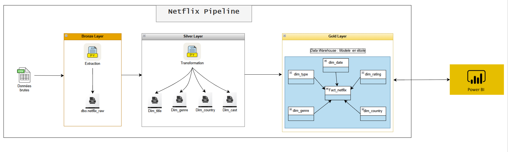

# Netflix ETL Pipeline

Pipeline ETL complet pour analyser les données Netflix avec Python, MSSQL.

---

## Structure du projet

```
netflix_etl/
├── data/
│   └── netflix_titles.csv
├── db_config.py
├── 01_bronze_extraction.ipynb
├── 02_silver_transformation.ipynb
├── 03_gold_datawarehouse.ipynb
└── README.md
```

---

## Architecture du Pipeline

>
> 
---

## Base de données

- **SGBD** : Microsoft SQL Server (MSSQL)
- **Base** : `netflix_db`
- **Schémas** : `bronze`, `silver`, `gold`

---

## Auteur

**BOUACHRINE Yassine** — Projet ETL Netflix | MSSQL + Python
